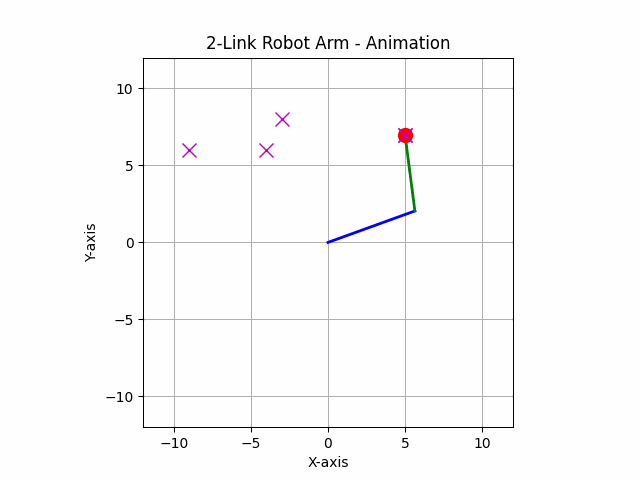

# SCARA Robot Project

<p align="center">
  
</p>

## 📌 Project Overview
This project involves the development of a **SCARA (Selective Compliance Assembly Robot Arm)** designed for precise movements using **servo motors** controlled via a Python script.

## 🔥 Features
- **Graphical User Interface (GUI)** for easy control  
- **Vision-based color detection** using OpenCV  
- **Real-time servo control** with inverse and forward kinematics  
- **Automatic calibration** for precise positioning  
- **Raspberry Pi 5 integration** for hardware control 

## 🛠️ Technologies Used
- **Programming Language:** Python  
- **Front-end:** PyQt6  
- **Back-end:** OpenCV, gpiozero, Adafruit ServoKit  
- **Hardware:** Raspberry Pi 5, PCA9685 Servo Controller, Webcam 

## 📊 System Workflow
1. **User initializes servos** and sets the zero position  
2. **Webcam detects object colors** for positioning  
3. **SCARA robot calculates inverse kinematics** for movement  
4. **User enters target coordinates** via GUI  
5. **Robot moves automatically** based on computed angles 


## 🔍 Research Contribution
This project was developed as part of an advanced robotics course, focusing on **kinematics, automation, and real-time control**.


## 🚀 Installation & Usage
### **1. Clone the repository**
```sh
git clone https://github.com/RawichSinghachai/Scara-Robot.git
```

### **2. Install dependencies**
```sh
cd me484
python -m venv env
# For Windows
env\Scripts\activate
# For macOS/Linux
source env/bin/activate
pip install -r requirements.txt
```
### **3. Run the Application**
```sh
python gui.py
```


## 🎛️ GUI Control Features
- Calibration: Input workspace coordinates and calibrate
- Servo Control: Adjust servos via sliders
- Automated Movement: Enter coordinates, calculate angles, and move
- Webcam: Detect colors for object positioning


## Implementation
The implementation involves setting up the hardware, writing the control scripts, and calibrating the robot for accurate movements. The main scripts used are:
- `vision.py`: Handles color detection and webcam input.
- `set_zero.py`: Initializes the servo motors to their zero positions.
- `servo.py`: Contains functions for controlling the servo motors.
- `gui.py`: Provides a graphical user interface for controlling the robot.
- `calibration.py`: Transforms pixel coordinates to real-world coordinates.
- `arm_robot_movement.py`: Handles inverse and forward kinematics for the robot arm.

## Simulation
<p align="center">  </p>

## Demo 
<p align="center">  </p>
